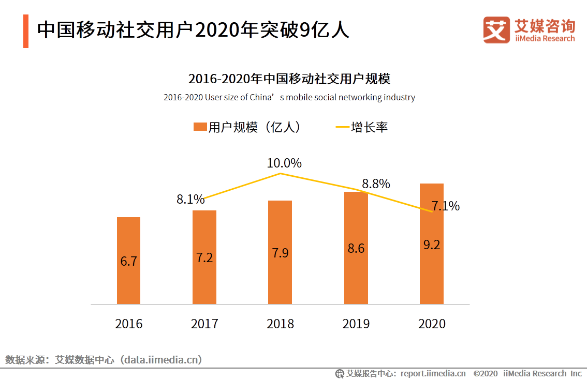
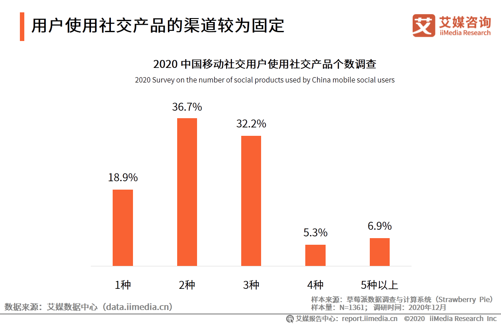
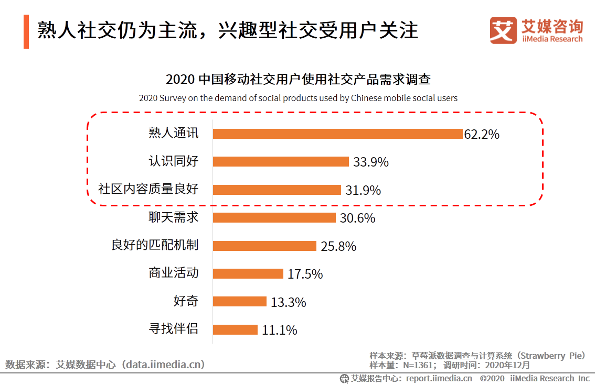
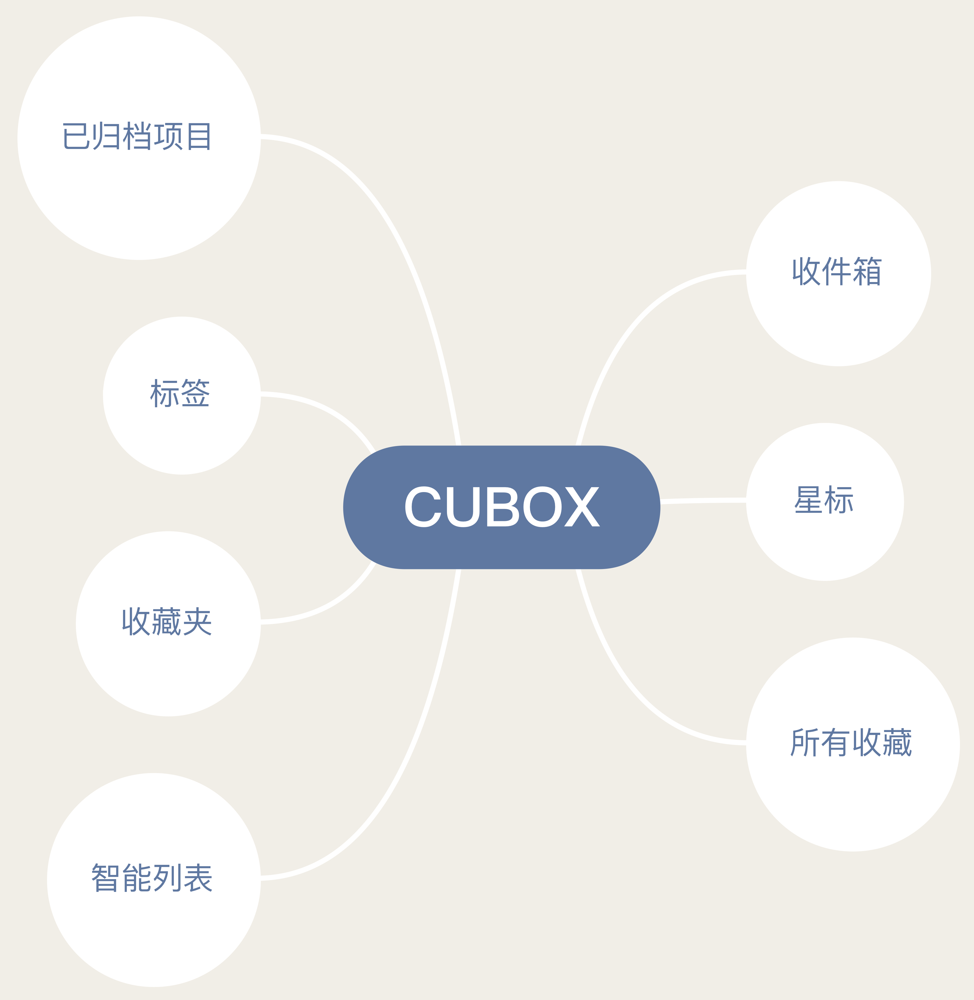
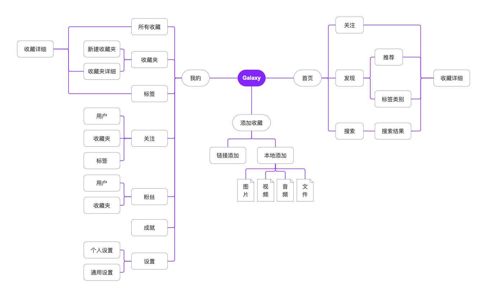
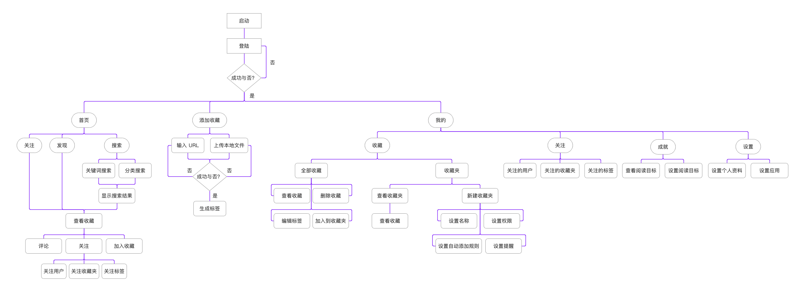

# 💹 Galaxy 市场需求文档
## 一、产品定位
## 二、目标市场
### 2.1 市场与行业规模
- ***社交软件市场规模***
  - 据国家统计局数据显示,全国互联网上网人数逐年上涨,增速平稳,截至2017年已经达到7.7亿人。而移动互联网的用户量则更大,普及率也高。这在一定程度上促进了社交网络的快速发展,为社交应用的上市奠定了人口基数。截至2018年12月，中国网民规模为8.29亿，全年新增网民5653万。其中，手机网民规模达8.17亿，约占中国网民规模的98.6%，2017年这一比例为97.5%。
  - 据统计，2018年最受我国消费者欢迎的即时通讯与社交品牌依次为微信、QQ、微博，相应比例分别为94.4%、71.4%和24.5%。数据显示，2016年我国社交网络广告规模为239.6亿元，2017年达376.2亿元，2017年我国移动社交用户在移动社交应用内付过费的比例达55%，并且40.4%的用户付费额在50-250元之间。未来5年，全球社交用户数也将从23.4亿人增长至37.5亿人。

- ***中国移动社交行业规模研究***  
iiMedia Research(艾媒咨询)数据显示，2020年中国移动社交用户规模突破9亿人，较2019年增长7.1%。艾媒咨询分析师认为，随着图片社交、声音社交、视频社交等产品形态的创新以及革新，移动社交市场将保持稳健发展态势，用户渗透率稳步增长。

### 2.2 市场现状
- ***总体情况***  
  - 近年来，微信、QQ、陌陌等网络社交平台上诈骗案件频发，花样可谓层出不穷，不仅给群众带来财产损失甚至生命危险，而且极大损害各社交平台形象。
  - 社交电商指利用社交媒体帮助消费者作出决策及获取产品和服务的电子商务活动。企业通过社交网络推广产品、渠道、提供信息服务，用户则从社交网络平台获取信息资源、购买商品。

- ***用户使用社交产品的渠道较为固定***  
iiMedia Research (艾媒咨询)数据显示，受访移动社交用户中36.7%表示使用2种社交产品，32.2%用户使用3种社交产品，仅一成用户表示使用4种以上社交产品。艾媒咨询分析师认为，超八成用户使用3种以内社交产品，产品使用习惯趋于稳定。用户产品迁移门槛逐步提升，创新产品市场竞争激烈。

- ***熟人社交仍为主流，兴趣行社交受用户关注***  
iiMedia Research (艾媒咨询)数据显示，受访移动社交用户中62.2%表示使用社交产品是为了与熟人保持联系，33.9%表示是为了认识有相同兴趣的人，31.9%表示是受内容吸引。艾媒咨询分析师认为，通讯需求仍占较大比重，其次是交友、娱乐和聊天需求。以兴趣为边界，构建良好社区内容以及完善的聊天功能，是未来社交产品的设计方向。

### 2.3 市场前景
- ***2020年社交软件行业发展前景趋势***  
社交电商用户年龄分布方面，25岁以下用户占比36%。25岁-30岁用户占比38%，还有11%的用户年龄在31-35岁之间。整体看来，移动社交用户主要以80、90后为主，00后是移动社交网络界的新生代，而主打年轻一代的社交电商用户规模势必会随年轻人对社交网络、移动互联网使用率的增长而水涨船高。

- ***细分垂直赛道服务更多群体，注重对用户群体需求的深入挖掘***  
熟人关系赛道被微信与QQ牢牢占领，同时，行业仍持续涌现创新产品形态，当下细分垂直赛道的移动社交产品则主要服务于不同人群的人际交往需求。其中，内容生态的建立，聊天方式的优化是社交产品留住用户的关键。而社交产品突破重围的关键，在于对目标用户群体需求的细化，以及产品功能的差异化创新。

- ***内容监管趋于规范化，审核过程仍难避纰漏***  
移动社交产品担负着信息传播的职能，是重要平台之一，因此对传播内容的把控与监管是其需要重点关注的地方。对于任何社交平台来讲，内容监管无可避免的需要耗费极大的物力及人力。未来随着技术的发展，内容监控的成本将会降低，监控的准确度则会上升。同时，经历行业监管趋紧、行业洗牌之后，移动社交行业迎来了更有序的发展。更加健康的互联网环境，不仅有利于用户的体验，也会带来整体行业的良性发展。

## 三、用户分析
### 3.1 目标用户
* **人群定位**：青年及中青年群体
* **年龄层**：15-45岁  
根据产品定位是一款兼具“收藏与社交”的APP，我们将用户定位在15-45岁的群体中，这类人群具有明显的兴趣差异，在日常生活中对于收藏分类喜欢的内容和与他人社交有很大需求，对平台发展会有较大的推动作用。
* **具体人群**
1. 经常在网络上浏览图片、视频、文章或网页的人群
2. 有对喜欢的内容进行收藏或保存习惯的人群
2. 喜欢与他人在网络上进行交流、分享的人群
3. 需要有条理得归纳、整理文件的人群
4. 爱好小众，希望找到有相同爱好的用户的人群

### 3.2 用户痛点
* 一个普通的APP内一定存在收藏这一功能，但收藏的内容只存在于那个软件内，如果用户想要将不同平台的类似内容进行收藏分类，就需要保存到自己的手机上，这样的操作较为麻烦，**既不能够让用户清晰得看到收藏内容的类型，又降低了用户在收藏之后再次翻找出来和对其进行查看的欲望**。  
* 用户收藏的东西一定是用户喜欢或有实质用途的内容，如果他们想要与和自己具有相同爱好的人分享自己收藏的内容，比如图片或视频，普通的手机软件的收藏夹不存在与他人分享交流的功能。

### 3.3 用户需求分析
* 对收藏的图片、视频、文章或文件等资源进行有效分类
* 能够将不同平台的内容进行收藏并打上标签
* 让收藏的内容可以收到提醒以便在空闲时进行翻看
* 能够看到收藏过相同内容的用户的开放收藏夹并与其进行交流或资源分享

### 3.4 用户画像与描述

### 3.5 用户使用场景
* 小玲在上课时收到老师发送的期末复习资料文档，她将文件添加进Galaxy进行收藏，Galaxy智能识别出文件类型，并为此文件添加了#期末复习资料#标签，对文件进行分类保存。
* 小玲下课回到宿舍，打开手机放松娱乐，看到一个有趣的视频，便添加进Galaxy进行收藏，Galaxy对视频添加#娱乐视频#标签进行分类；过了一会儿，小玲的Galaxy推送了一条消息：“有新用户关注您收藏的娱乐视频标签内容”。
* 在晚饭后，小玲收到Galaxy的智能收藏提醒：“您收藏的运动视频已经很久没有看过...”，于是小玲在空闲时间打开收藏夹回顾运动视频。
* 小东在上班的时候遇到了设计问题缺乏灵感，于是打开微博看到设计美学博主发的文章，看了一会儿他感觉用处很大，于是将这篇上传进了Galaxy收藏，Galaxy通过智能识别，为文章打上#设计#、#前卫#标签进行分类。
* 小东下班后回到家里，发现收到Galaxy的一条推送消息：“为您推荐其他用户收藏的#设计师#、#平面设计#相关内容”，于是点进APP查看并关注了一个用户的#设计#标签收藏。

## 四、竞品分析

### 4.1 Cubox竞品分析

#### 4.1.1 竞品社交、推荐功能架构图 

#### 4.1.2 竞品简介

- Cubox是一个现代化书签收藏夹，帮助我们高校收藏、 智能管理网络碎片信息。
- Cubox专为新时代数字工作者打造，是我们的私人网络信息助手。当你在网络上发现了自己在意的新闻、文章、资料、视频等内容，可以通过Cubox提供的快捷收藏工具将他们快速保存。在之后工作和生活中，当你需要它们时，能够随时在Cubox中浏览或搜索，不必担心遗忘。
- Cubox提供智能分类功能，告别繁琐的手动整理，收藏再多也能保持井井有条，在关键时刻，帮助你随时找到想要的信息。

#### 4.1.3 竞品用户、优势、劣势

产品|Cubox
--|:--:
定位用户|用户年龄分布在18到30岁之间，以学生、白领居多
产品定位|基于为新时代数字工作者提供收藏的平台
优势|1. 用户群体年轻化、基数大 2. 内容丰富、使用简单 3. 社交功能强大
劣势|1. 使用费用昂贵  2. 核心功能未完善 3. 没有多级文件夹

#### 4.1.4 竞品亮点

- **收藏**

在Safari和各类App中，通过系统的分享菜单一键收藏；复制App中的文章链接，或是朋友发来的链接，下拉通知中心一键收藏；你还可以在浏览器上使用自己定义的书签工具来收藏书签或文本片段。你的所有书签都将在网页和你的所有Apple设备间随时同步，为你的下一步操作做好准备。
  
- **智能分类**  

通过设定搜索规则来创建智能分类，这样你不需要自己整理书签，就可以同时查看某一网站，或主题的相关书签，并集中处理。智能分类规则支持多个关键词，支持设置每个关键词的筛选位置、筛选条件等。所有的智能分类规则将在多个平台和设备间随时同步。
  
- **灵活管理**  
  
收藏夹配合标签，可以将大量的书签管理得井井有条。在Cubox应用中，可以通过简单的多选和系统的拖拽手势进行批量操作，再多收藏也能轻松恢复整洁。

#### 4.1.5 与本产品主要功能对比

功能|Galaxy|Cubox
--|:--:|:--
社交|√|×
收藏|√|√
跨平台收藏|√|√
智能分类|√|√
灵活管理|√|√

#### 4.1.6 主要差异

- Galaxy主打的是收藏+社交模式，而Cubox则是主打收藏，让用户可以查看自己所收藏的内容。
- Galaxy通过对相似类型的收藏内容进行分类、标记，并且可以通过关键字、分类搜索来搜索收藏内容，让用户可以更加方便的寻找到自己想要收藏内容，而Cubox的收藏功能则是比较简单，操作方便，搜索功能不完善，且使用费用昂贵，这降低了用户对于收藏功能的使用体验。

### 4.2 小红书竞品分析

#### 4.2.1 竞品社交、推荐功能架构图

#### 4.2.2 竞品简介
- 小红书的slogan是“标记我的生活“，主要用户群集中在20-35岁的女性，这一年龄段的女性对没美的追求比较强烈，也很热衷网络社交。小红书就提供了一个这样的平台，让爱分享的用户在这样一个社区平台进行交流，通过发布笔记，可以记录自己的购物分享以及各类生活讯息。
- 在注册小红书并登录以后，会为其推荐关注度高的优质笔记。进入小红书以后，映入眼帘的便是推荐的笔记，这为小红书用户的使用时长打下了很好的基础。首页是关注、发现、商城，从关注可以看出，小红书比较注重社区体验，让用户可以通过笔记内容从而进行一系列的评论、点赞、关注等互动，而发现就是推荐的内容，商城就是让用户购买的地方了

#### 4.2.3 竞品用户、优势、劣势

产品|小红书
--|:--:
定位用户|用户年龄分布在18到30岁之间，以学生、白领居多，当中女性占到70%到80%
产品定位|基于生活分享社区的跨境电商平台
优势|1. 用户群体年轻化、基数大、明星入驻 2. 内容优质且丰富多样 3. 社交功能强大
劣势|1. 小红书平台各类标签（栏目）已日趋完善，所剩空间狭小  2. 大部分受众对小红书的品牌形象停留在美妆、穿搭上 3. 小红书平台账号运营变现能力差 4. 假货问题难以解决

#### 4.2.4 竞品亮点

- **发现**

  在登录小红书以后，会让用户查找自己的微博好友、推荐关注用户等。然后便进入了首页，小红书首页焦点就是在发现，通过一部分用户发布笔记产出的内容来为另一部用户进行推荐，在用户首次进入小红书的时候，会让用户产生更高的兴趣以及建立了一定的信任，使用时间也会有一定的提升。
  
- **推荐**  

  在用户新进入小红书或者隔了一段时间进入小红书时，会弹出“我感兴趣”的界面，让用户选择感兴趣的笔记标签，然后进入首页中的发现界面，小红书便会给用户推荐用户所选的标签内容的笔记用户也可随时更改自己的感兴趣的笔记标签。
  
- **关注**  
  
  能够关注自己感兴趣、喜欢的小红署，可以通过查看一些用户发布的笔记，利用点赞、评论或者收藏相互进行沟通，从而使得用户为用户进行口碑推荐。

#### 4.2.5 与本产品主要功能对比

功能|Galaxy|小红书
--|:--:|:--
社交|√|√
收藏|√|√
商城|×|√
跨平台收藏|√|×

#### 4.2.6 主要差异

- Galaxy可以聚合多个平台收藏自己感兴趣的内容，而小红书只能收藏用户在app上发布的笔记。
- Galaxy主打的是收藏+社交模式，而小红书则是主打社交+商城，让用户可以直接在app上购买在社区中被安利的好货。
- Galaxy通过对相似类型的收藏内容进行分类、标记，并且可以通过关键字、分类搜索来搜索收藏内容，让用户可以更加方便的寻找到自己想要收藏内容，而小红书的收藏功能则是比较简单，并且无搜索功能，这降低了用户对于收藏功能的使用体验。

---
# 📱 前端产品信息设计
### 产品架构图

### 主要功能使用流程图

